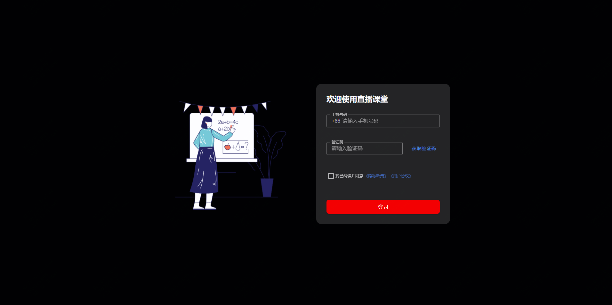
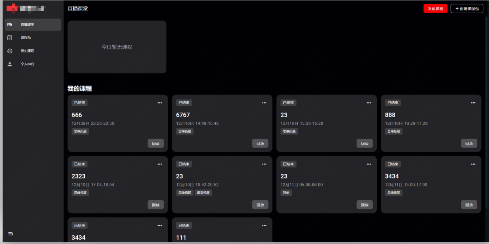
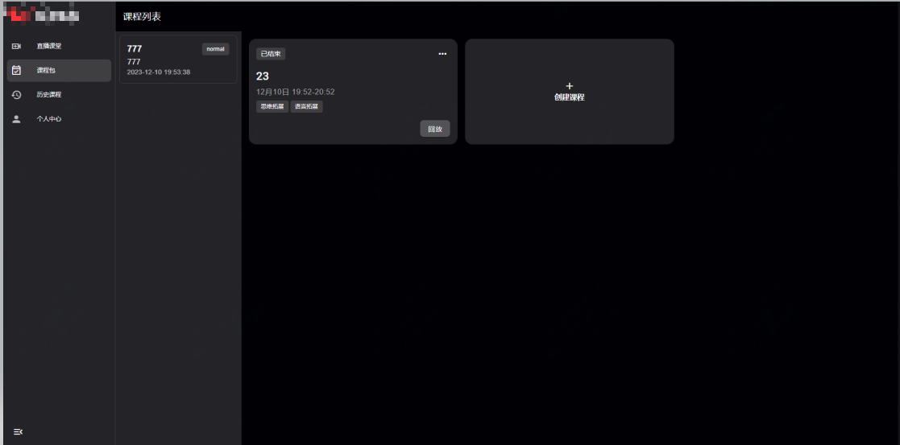

### 声网排课系统

* 集成了声网（agora）的灵动课堂，开箱即用，支持一对一、一对多、小班课
* 支持课程管理、课程预约等功能
* 课程中可使用白板、屏幕共享、聊天、举手、点名、课堂测验等功能

### 技术栈

* 使用 Vue3 + Vuetify + Vite 开发
* 使用 lottie 动画
* Mock 数据
* 使用多页面的方式，将直播页面和管理页面分开，方便管理

### 部分页面展示

#### 1、登录页面

#### 2、课程管理页面

#### 3、课程列表页面

# goalgo-website-agora
